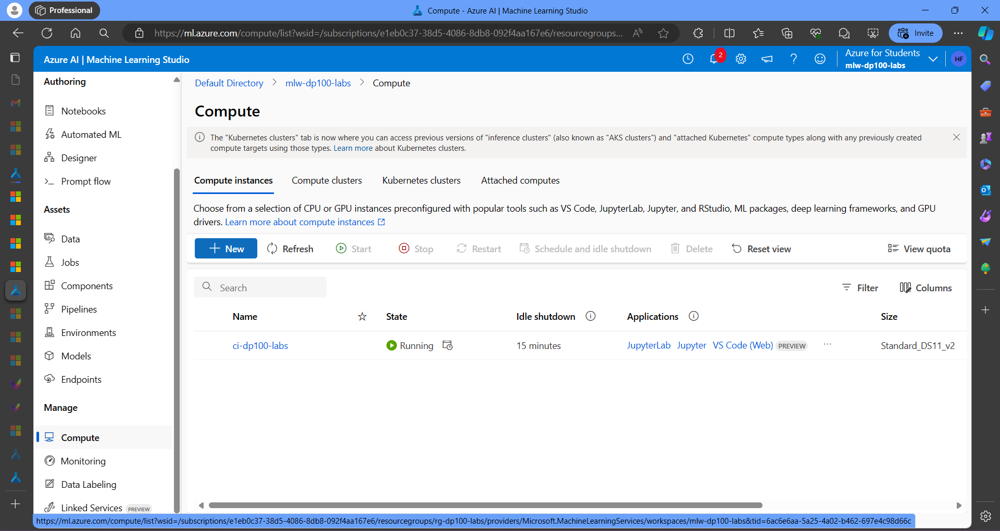
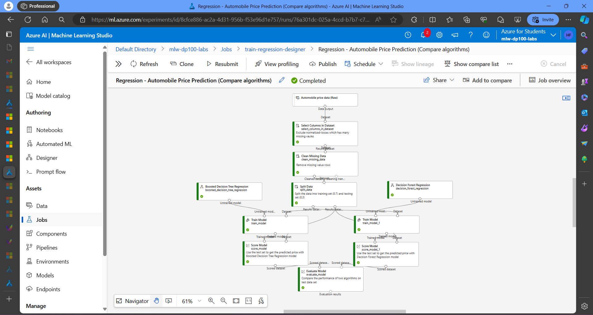
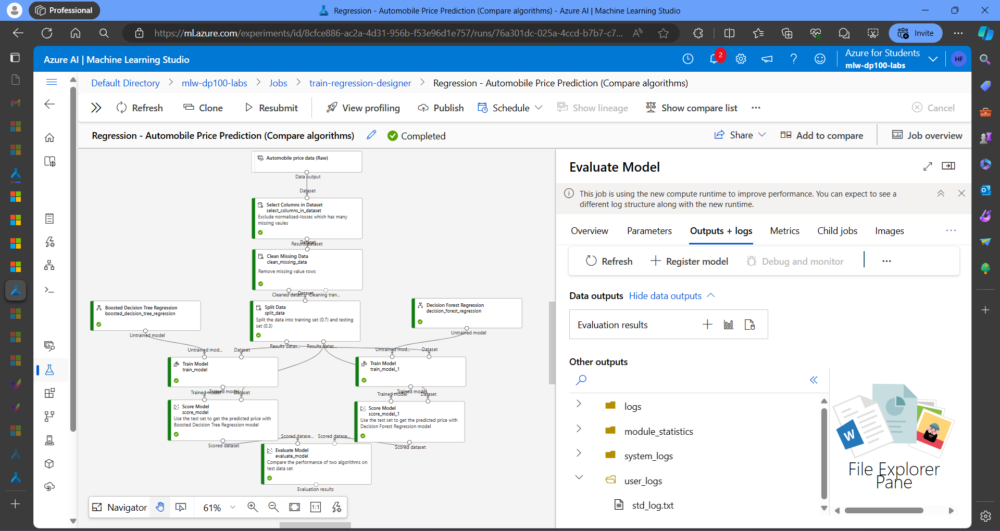
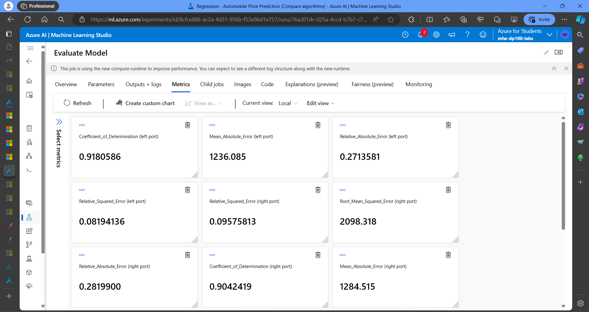
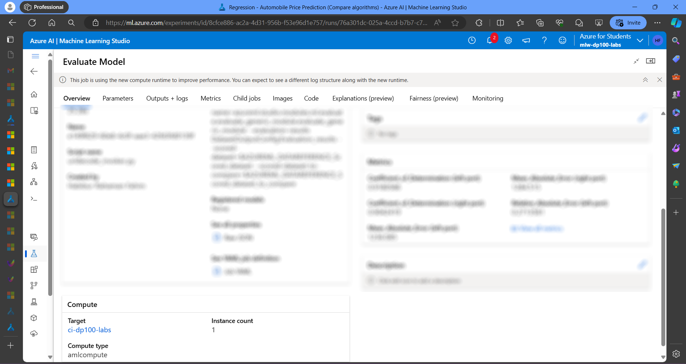
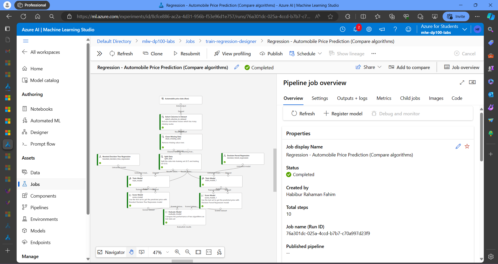
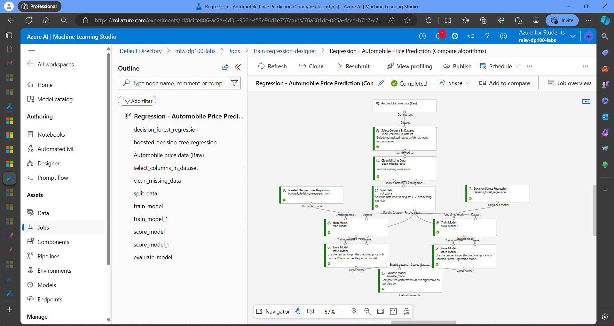

# Comparing Regression Algorithms on Microsoft Azure

This project offers a comprehensive exploration of the Azure Machine Learning workspace, culminating in the development, training, and evaluation of a **Boosted Decision Tree Regression** model for predicting **Automobile Prices**. 

## Visualizing the Workflow

This folder contains a series of screenshots captured throughout the practical session. These screenshots detail the following:

- **Workspace Creation:** This screenshot showcases the creation process of Azure Machine Learning workspace named `mlw-dp100-labs` within the Azure portal. This workspace serves as the central hub for all machine learning assets and experiments. 

- **Dataset Exploration:**  It demonstrates the exploration of datasets available in the workspace. Here delved into details  like data descriptions, formats, and potentially visualize data distributions to gain a thorough understanding of the data used for model training. This understanding is crucial for selecting appropriate features and pre-processing techniques. 

- **Experiment Configuration:** This one depicts the meticulous configuration of the training experiment. As named it  `"Regression - Automobile Price Prediction (Compare algorithms)"` to reflect the goal of comparing different regression models to identify the one that yields the most accurate price predictions. The screenshot also highlights the chosen compute target, which provides the necessary computational resources for training the model efficiently. 

- **Model Training and Evaluation:** This combined view showcases the training and evaluation stages. First screenshot displays the evaluation of the trained model using two relevant metrics. These metrics are of Mean Squared Error (MSE) or R-squared, which provide insights into how well the model's predictions match the actual automobile prices.   
The second Screenshot captures the successful completion of the training job named `"train-regression-designer"`, indicating that the model training process has finished. 

 

- **Model Registration:** This demonstrates registering the trained model named `"regression-auto-price-prediction-multi-algo-compare"` (version 1) for future use. Registering the model allows to easily deploy it in various scenarios, such as web services or mobile applications, for real-world price estimations. 

## Project Purpose and Insights

This project goes beyond simply training a model. It provides hands-on experience with core functionalities of the Azure Machine Learning workspace, allowing to build a strong foundation for future machine learning endeavors:

* **Comprehensive Workspace Management:** Here, successfully created and managed an Azure Machine Learning workspace, establishing a central hub for machine learning projects. This workspace provides a centralized location to store datasets, models, and experiments, fostering organization and collaboration.
* **Data Exploration and Understanding:** By exploring the datasets within the workspace, gained valuable insights into the data used for training the regression model. This understanding is crucial for selecting appropriate features and pre-processing techniques that can significantly improve model performance.
* **Meticulous Experiment Setup:** Configured a training experiment with a clear goal (comparing regression algorithms) and ensured the availability of necessary compute resources for efficient training. This meticulous setup helps to ensure that the experiment runs smoothly and produces reliable results.
* **Regression Model Selection and Training:** Trained a regression model to predict automobile prices. Boosted Decision Tree Regression used here.
* **Model Evaluation and Interpretation:** Evaluated the performance of the trained model using relevant metrics like MSE or R-squared. Analyzing these metrics helps assess the model's accuracy and effectiveness in predicting automobile prices. Here also explored techniques to interpret the model's behavior and identify factors that significantly influence automobile prices.
* **Model Registration and Reusability:** Registered the trained model, making it reusable for future deployments in web services or other applications. This allows to easily integrate the model into various scenarios without retraining it from scratch.
